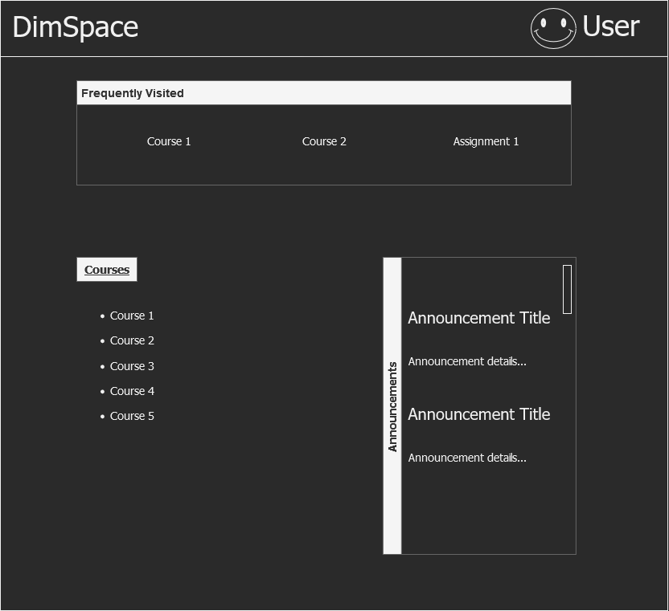
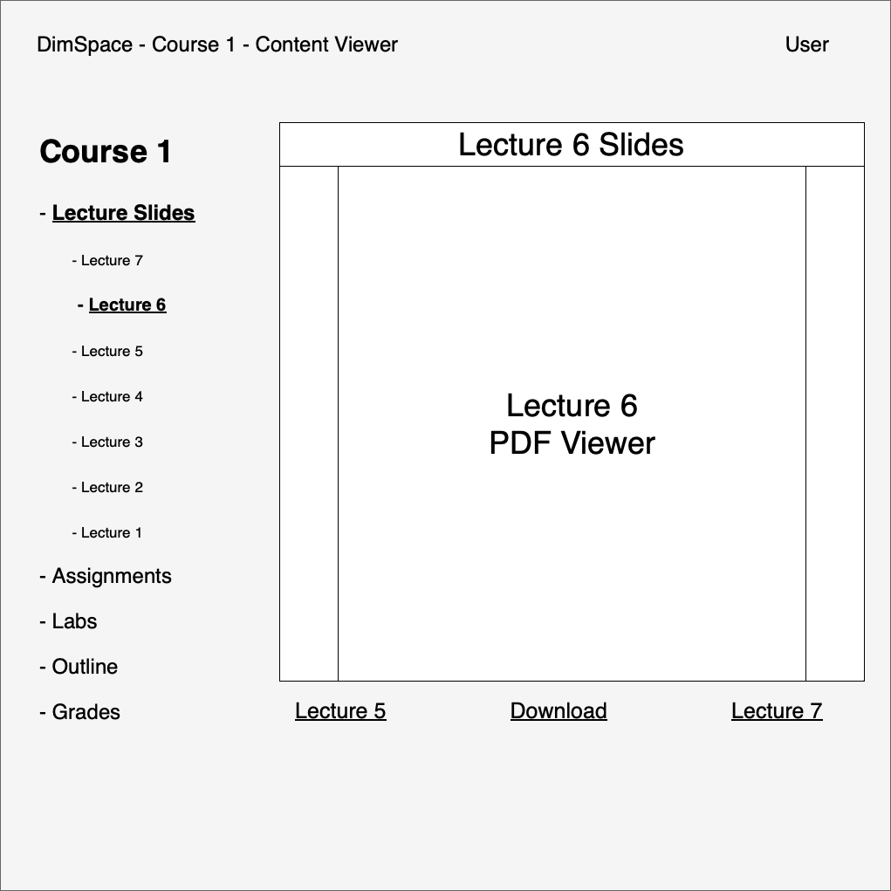
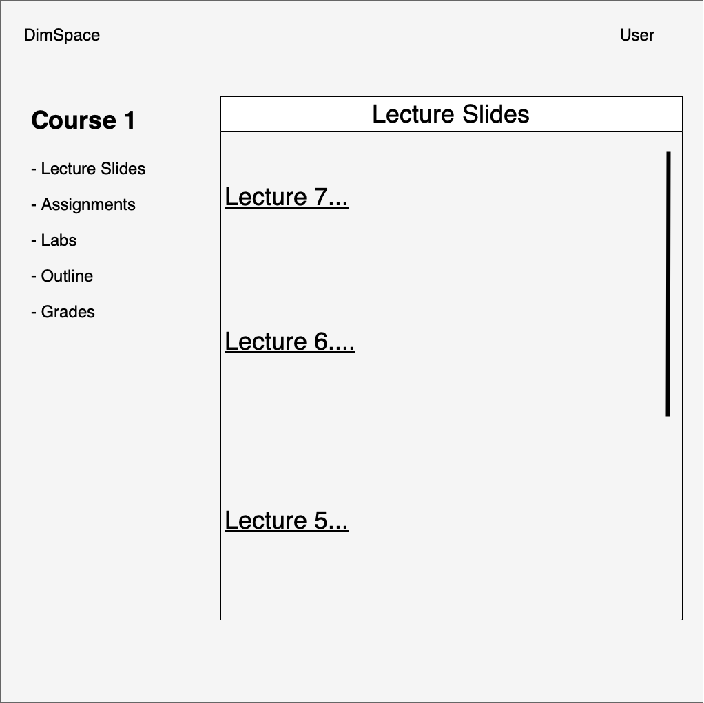
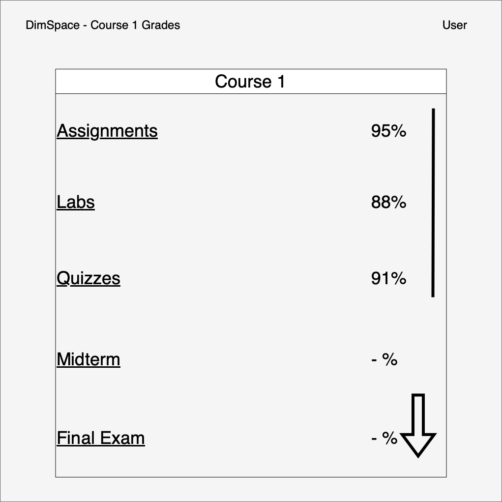
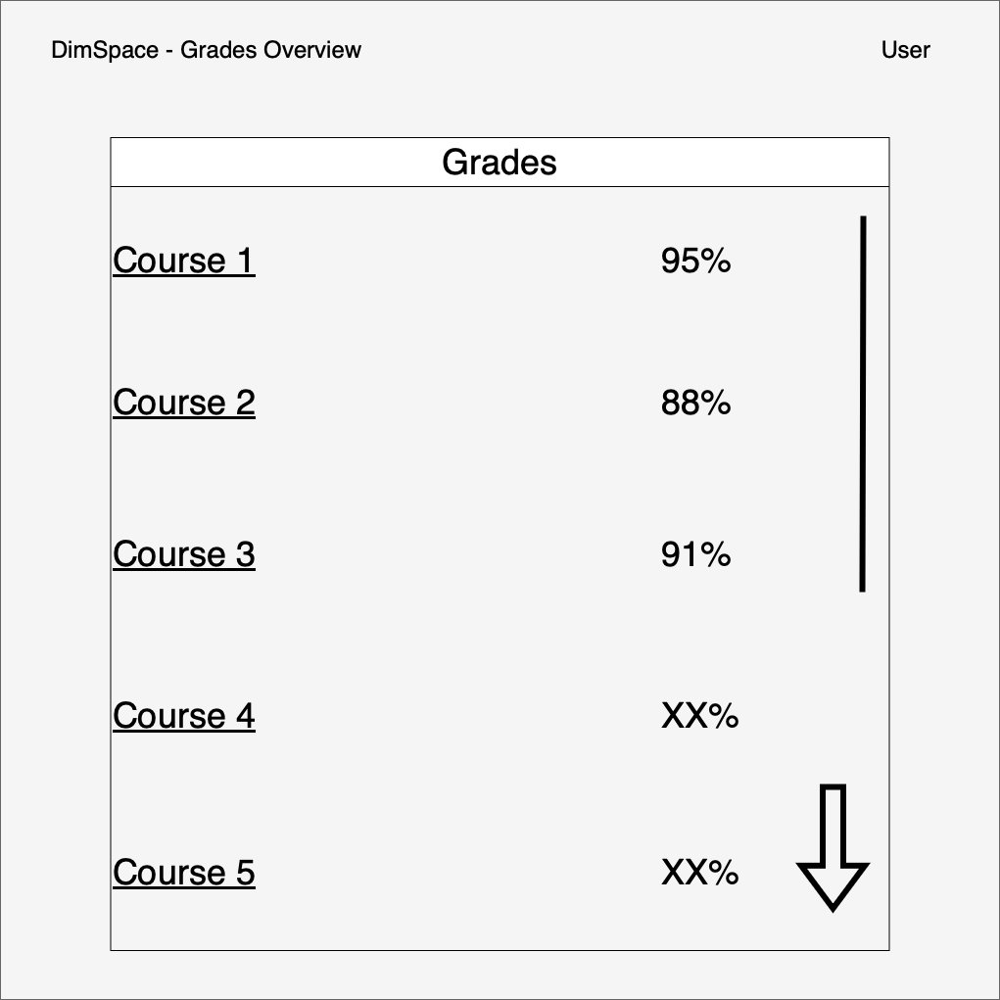

Assignment 1
============

̄<!-- TOC -->
* [Request for Proposal](#request-for-proposal)
* [Requirement Document](#requirement-document)
* [Software Self Adaptation](#software-self-adaptation)
* [Architecture](#architecture-mental-model)
* [UI](#ui)
* [Software Development and tools](#software-development-and-tools)
  * [Backend](#backend)
  * [Frontend](#frontend)
<!-- TOC -->

## Request for Proposal

We created a request for proposals for our developer team which can be found [here](as-clients/rfp.md).

## Requirement Document

Based on the RFP that our client team provided, we created a Requirements Document which can be found
[here](as-developers/rd.md).

## Software Self Adaptation

For our software self-adaptation component, we decided on two light adaptive features for our LMS application:

1. **Adaptive Notifications.** The system will observe how users interact with notifications for deadlines that are sent,
and adapt to send users notifications at times that they find most useful, based on when they are most likely to open
the notification.
2. **Frecency.** The system will keep track of which pages a user visits most *often*, as well as which pages a user has
been visiting most *recently*. Pages that score highly on a combined *frecency* metric will be presented to the user in
a list for quick navigation.

These aspects are also detailed in our [requirements document](as-developers/rd.md).

## Architecture

The architecture for the application is illustrated with this diagram:

̄

## UI

Here are some UI mockups for how we believe the app will look:

## Software Development and tools

### Backend

The backend will be written in [Kotlin](https://kotlinlang.org) using the
[Spring Boot](https://spring.io/projects/spring-boot) framework. A preliminary implementation with some "hello, world"
functionality is available in the repository [here](as-developers/backend).

### Frontend

The frontend will be written in [Python](https://www.python.org) using the (Django)[https://www.djangoproject.com]
framework. A preliminary webapp with some "hello, world" functionality is available in the repository
[here](as-developers/frontend).
