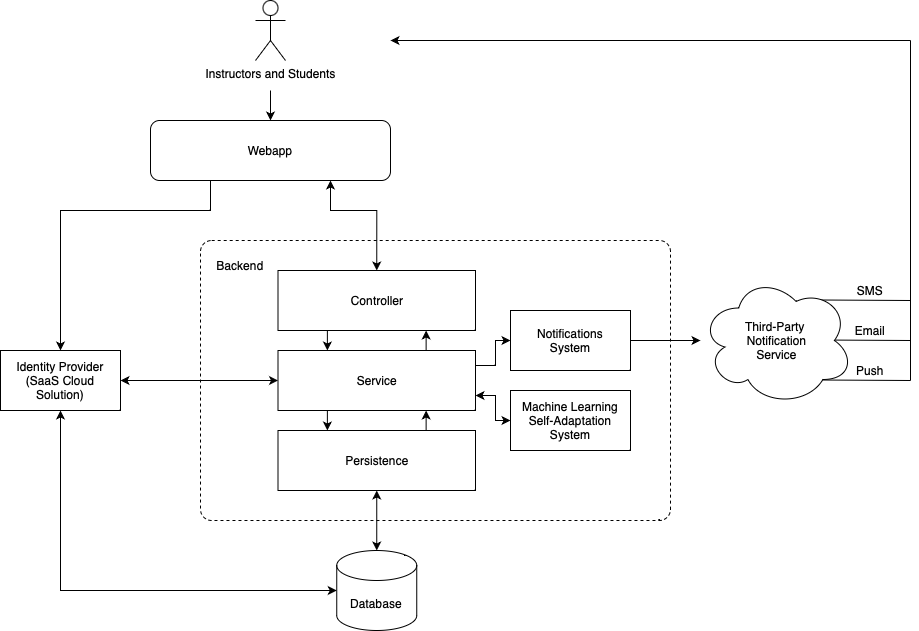

Assignment 2
============

<!-- TOC -->
* [Request for Changes in the Requirement Doc](#request-for-changes-in-the-requirement-doc)
* [Updates to Requirement Document](#updates-to-requirement-document)
* [Updated Architecture Diagram](#updated-architecture-diagram)
* [Continuous Integration and Continuous Delivery](#continuous-integration-and-continuous-delivery)
  * [CI: Frontend](#ci--frontend)
  * [CI: Backend](#ci--backend)
  * [Continuous Integration](#continuous-integration)
* [Limited Functionality Implementation](#limited-functionality-implementation)
<!-- TOC -->

## Request for Changes in the Requirement Doc

After reading our developer team's Requirement Document, we identified some changes that could be made, and these are
described in the **Request for Changes in the Requirement Documentation** document which can be found [here](as-clients/request-for-change.md).

## Updates to Requirement Document

Based on the RFC sent to us by our client team, we made some changes to our RD. Specifically, the following changes
were made:

- Added more explicit specification for the operating environment;
- Clarified that instructor users may set grades above 100% if they choose;
- Added section 3.5, detailing new requirements for user authentication, improving security of the application;
- Added section 3.6, detailing new requirements for user profiles, including associating additional contact methods;
  with user accounts in order to improve account recoverability;
- Added section 3.7, detailing new requirements for notifications, which will allow users to customise what notifications
  they receive, for what content, and at what times; and finally
- Clarified that the new system should integrate will UVic single sign-on.

View the updated requirement document [here,](as-developers/rd.md) and if you like, view the earlier version from
Assignment 1 [here.](https://github.com/stephenneale/seng371-group16/blob/272f786ad49cb4f390f7a91ad860711748f18b80/as-developers/rd.md)

## Updated Architecture Diagram

For the most part, the only changes to the Requirements Document that necessitated changes to the architecture diagram
were for the notifications feature. The updated architecture diagram illustrates how the system will deliver
notifications to users, by showing a new notification system which integrates with a third-party notification service.

As a whole, the system consists of a few parts:

1. Frontend
   - Written in Python using the Django Framework, the frontend delivers packaged HTML, CSS, and JS files to the
     user's browser, so they may interact with the site.
2. Backend
   - Written in Kotlin using the Spring Framework, the backend manages data and makes it accessible for consumption
     by the frontend webapp through a REST API.
     - Controller: defines the API,
     - Service: defines business logic, and
     - Persistence: saves and manages data in a durable way.
   - The database is the physical storage medium for the data, which the persistence layer of the backend manages.
   - The notifications system acts as an adapter to the third party notifications service.
   - The third party notifications service provides functionality to deliver notifications to users such as SMS, Email,
     and push notifications. A third-party solution is desirable because implementations are available that are more
     reliable than what we could build, while being more affordable in the medium term.
   - The machine-learning self-adaptation system provides the self-adaptation components described in the RD, including
     adaptive notification timing and frecency.
   - The identity provider provides user accounts for use in the system. In this case, it will be UVic's Single Sign-On.

(if you like, view the first version of the architecture diagram [here](https://github.com/stephenneale/seng371-group16/blob/e3abecc3e59a4e7861fe0ae49a175b2caf5620da/as-developers/images/architecture.png))

## Continuous Integration and Continuous Delivery

We have implemented Continuous Integration for the Frontend and Backend sections of the app, which are triggered
when new changes are pushed to this GitHub repository. These are implemented using GitHub Actions, using various
tools depending on the environment and framework which is different between frontend and backend.

### CI: Frontend

Upon each push to the repository, a Python environment is set up, and Django's built-in tests are run using the
`python3 manage.py test` command. This runs tests defined in `tests.py`, and if all tests pass, the CI step reports
a success.

An example of this CI step running on this repository can be found [here](https://github.com/stephenneale/seng371-group16/actions/runs/4339121280)

### CI: Backend

Upon each push to the repository, a Java environment is set up, and `mvn package` is run, which builds the Kotlin
backend, and runs all tests defined within the `test` package of the backend. This test cycle is managed by Maven, the
project's build tool. If all tests pass, the CI step reports a success.

An example of this CI step running on this repository can be found [here](https://github.com/stephenneale/seng371-group16/actions/runs/4339121277)

### Continuous Integration

Given that we aren't deploying a functioning app to any users, it doesn't make sense to speak much about continuous
delivery. We can imagine, though. For example, if this app was deployed on a Kubernetes cluster, then a continuous
delivery step might look like this:

**Given:** If Continuous Integration passed (i.e. there aren't any issues with the code)  
**Then:**  
1. Build and package the Django frontend into a Docker container,
2. Build and package the Kotlin backend into a Docker container,
3. Perform database migrations on production database,
4. Start incremental rollout of newly built containers, monitoring for signs of failure,
5. Finish rolling out new versions.

## Limited Functionality Implementation

We've coded some limited functionality into the project. Concretely, a user can now:

- View a homepage with one course,
- Click the course,
- View content associated with the course.

This involved work on the frontend (to fetch and render the data) and the backend (to host and serve the data).

Feel free to try out a running version of the app [here! (external link)](http://159.223.198.2:8000/dimspace/)