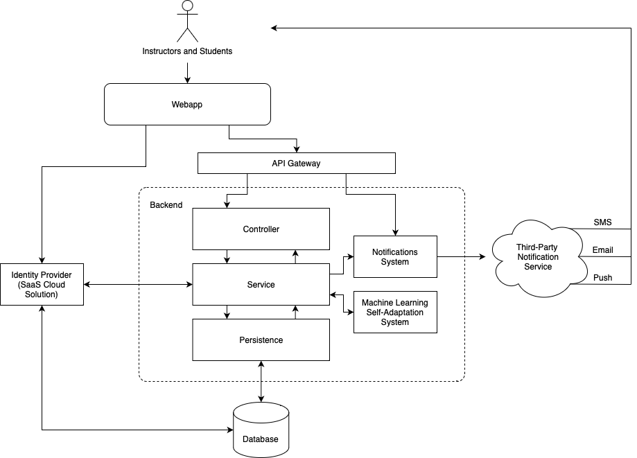

Assignment 4
============

<!-- TOC -->
* [Request For (%20 to %30) Changes](#request-for-changes)
* [Requirement Document](#requirement-document)
* [Architecture Mental Model](#architecture-mental-model)
* [Software Self Adaptation](#software-self-adaptation)
* [CI/CD Development Pipeline](#cicd-development-pipeline)
* [Implement The Application 100%](#implement-the-application-100)
<!-- TOC -->

## Request For Changes

As clients, we submitted a Request for (20% to 30%) Changes document to our developers (Group 17) of an Atlantean Banking software solution. 

[Please follow this link to view our submitted Request For Changes.](as-clients/assignment4-RFC-AtlanteanBanking.pdf)

As developers, we received a Request for Changes from our clients (Group 13) for the DimSpace course delivery webapp.

[Please follow this link to view our received Request For Changes.](as-developers/their-rfc-assignment4.pdf)

## Requirement Document

After receiving the Request for Changes from our clients, we updated our Requirement Document for the DimSpace application.

[The updated Requirement Document can be found here.](as-developers/rd.md)

## Architecture Mental Model

The updated architecture diagram has the addition of an API Gateway. This gateway will act as a single service dedicated to receiving API requests and dispatching commands to the appropriate services. As our API becomes more complex, it is useful to centralise the definition of the backend interface (API) as its own dedicated component, instead of relying on each service to expose its own API. Additionally, this means that the implementation of API endpoints can be drastically changed (e.g. being handled by an entirely different service) without affecting users.

## Software Self Adaptation

The "Recently Viewed" feature on the DimSpace home page is a tool that allows users to quickly access previously viewed course content. The implementation of this feature involves software evolution, which is the process of making continuous improvements to software through updates and iterations. As users view course content on DimSpace, the Django framework records their browsing history and stores it in the Springboot API. The two then work together to sort the data and display the most recently viewed items to the user. As the platform evolves, we can enhance this feature by incorporating user feedback, improving the algorithms to a "frecent" approach, and optimizing the database for faster retrieval. Through this continuous process of evolution, the "Recently Viewed" feature can become more intuitive, personalized, and efficient over time, leading to a better user experience.

## CI/CD Development Pipeline

### Frontend CI:

To set up a CI pipeline for the frontend Django web-app, we’ve created a GitHub specific YAML workflow file `dimspace.yml`  for the service to run each time the repository is changed. This workflow installs Python 3.9 into the workflow instance, along with other requirements such as `django` and `requests` python libraries for the Django framework located in `requirements.txt`. These libraries are then used to run the tests written in `tests.py` using Django’s built in testing suite via `python3 manage.py test`.

### Frontend CD:

For CD, Docker can then be used to create a Docker image of the Django web-app. This image is then pushed to a Docker registry found on a remote web server, which is used for production builds of the application. This specific step has not been implemented with Dimspace, as it would require the funds necessary to rent a web server and host the docker image. However, the workflow actions to perform this have been included below:

    - name: Build Docker Image
      run: |
        docker build -t dimapp .

    - name: Push Docker Image
      uses: docker/build-push-action@v2
      with:
        context: .
        push: true
        tags: dimapp:latest

    - name: Deploy to Production
      uses: username/ssh-action@webserver
      with:
        host: ${{ secrets.SERVER_HOST }}
        username: ${{ secrets.SERVER_USERNAME }}
        key: ${{ secrets.SERVER_KEY }}
        script: |
          docker-compose pull
          docker-compose up -d

### Backend CI:

We set up a CI pipeline for the backend Spring Boot application written in Kotlin with SpringMockk using GitHub Actions. We configured the workflow to run on the push event, so the workflow will automatically run each time a commit is pushed to the repository.

The workflow file, (`springboot.yml`), is stored in the `.github/workflows` directory in the root of the project repository. We used a preconfigured Maven environment for the action, which installs Maven into the workflow instance, along with other dependencies required by the application. These dependencies are specified in the project's pom.xml file.

Once the dependencies are installed, the job runs `mvn -B package` to build and test the application. The output of the build and test process is stored in log files associated with each invocation of the GitHub Action.

We can view the workflow status and logs in the GitHub Actions tab in the repository. This allows us to quickly identify any build or test failures and take appropriate action.

### Backend CD:

At this time, we have not set up a CD pipeline. While this is a logical next step, we have not done so due to the cost of hosting an instance of the application on a web server, which is the ultimate goal of continuous deployment. However, if we were to set up a CD pipeline, we could use Maven to package the application as a Docker container, tag it with a version number, and then upload it to an application server, or have the application rolled out using a container orchestration service like Kubernetes.

## Implement The Application 100%

As per the request for changes from our clients, the application has been fully developed. 

[The main 100% Implementation GitHub issue can be found here.](https://github.com/stephenneale/seng371-group16/issues/55)

[The remaining (now closed) GitHub Issues for Assignment 4 can be found here in the Assignment 4 Milestone.](https://github.com/stephenneale/seng371-group16/milestone/4?closed=1)

We have hosted a live version of DimSpace for demonstration purposes, which can be found below.

[Click here to visit a live version of DimSpace!](http://159.223.198.2:8000/dimspace/)

**Note**: If you choose to add a course, it will remain there until the web server is reset. To access "Dark Mode" for the webapp, expand the dropdown menu in the top-right portion of the screen.
